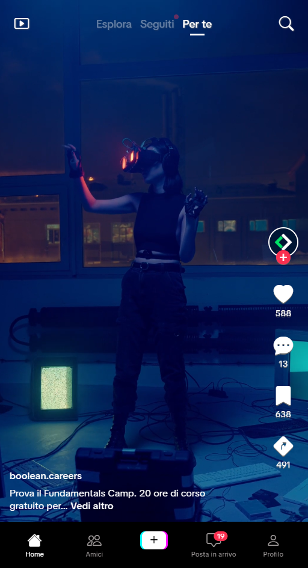

# HTML/CSS TikTok Reel

> Tip: Code decisions are explained in the [Implementation Notes](#implementation-notes)

Static TikTok Reel interface recreated with HTML and CSS for a web development course exercise.

## Live Demo

[View the live demo on GitHub Pages](https://emanuelefavero.github.io/htmlcss-tiktok-reel/)

## Exercise Goal

Match the provided reference layout using HTML and CSS, with a focus on Flexbox.

### Reference layout

## Scope

- Use HTML and CSS
- No JavaScript
- Mobile-first layout with `512px` width
- Work within Header, Sidebar, Footer from the boilerplate (see first commit in the repo)
- Bootstrap Icons for icons and TikTok Sans font for text.

## Implementation Notes

- The original boilerplate structure was preserved, using `.reel-page`, `.reel-header`, `.sidebar`, and `footer` as the main layout areas.
- Flexbox is used to align the header navigation, sidebar actions, and footer navigation.
- CSS custom properties keep repeated colors, icon sizes, and layout values easy to adjust.
- The sidebar no longer uses `top: 40%`; it is anchored from the bottom so the actions stay above the footer navigation, closer to TikTok's layout.
- CSS nesting is used intentionally because the project is small and does not need a reusable design system. Keeping selectors close to their parent sections makes the stylesheet easier to compare with the HTML structure.
- Accessibility details were added for icon-only controls, decorative icons, image dimensions, language metadata, and mobile video behavior.
- Button spacing is kept compact while preserving a larger clickable area for better mobile usability, using padding and flexbox to manage layout without fixed widths.
- After testing on mobile Safari, `border-left` and `border-right` were replaced with a single background gradient for the create button to avoid rendering issues.

&nbsp;

---

&nbsp;

[**Go To Top &nbsp; ⬆️**](#htmlcss-tiktok-reel)
